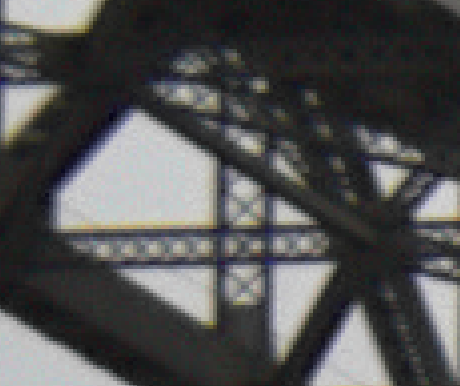

# Blind Chromatic Aberration Correction with False Color Filtering

|  |  |
|:----------------------------------------------------:|:-----------------------------------------------------:|
|                <i>Aberrated image</i>                |                <i>Filtered result</i>                 |

This is a repository containing a non-official Cython-based implementation of the IEEE Transactions on Image
Processing 2013 article *Correction of Axial and Lateral Chromatic Aberration With False Color Filter* by
Joonyoung Chang, Hee Kang and Moon Gi Kang.

The method consists in a 1D filter independently run on the columns and rows of an image containing chromatic 
aberrations. Merging the horizontally and vertically filtered outputs yields the final restored image. Our
implementation leverages the multi-threading abilities of Cython to achieve restoration on large images in less
than 1 second.

This implementation is part of an IPOL paper describing in the detail the method. If this code is useful to your 
research please cite our paper  (to appear).

### Testing the code

You can test the code with a test JPEG image containing chromatic aberrations. First, compile Cython code with
> bash compile_cython.sh

This will create in the main directory a filter_cython.c file. Second, you can restore the image with the command line:
> python main.py

This will save a 8-bit PNG file containing the restored image. The method can be also used on 16-bit TIFF images
or straight after demosaicking/denoising in a typical ISP pipeline.

### Requirements

Please run the pip install command below to install the requirements:
> pip install requirements.txt

### Description

The code contains two main modules: filter.py that is a numpy-pure implemention of the paper (and is extremely slow),
and filter_cython.pyx that contains the sources for the Cython implementation (recommanded).

### Contact 

If you encounter any problem with the code, please contact me at <thomas.eboli@ens-paris-saclay.fr>.
